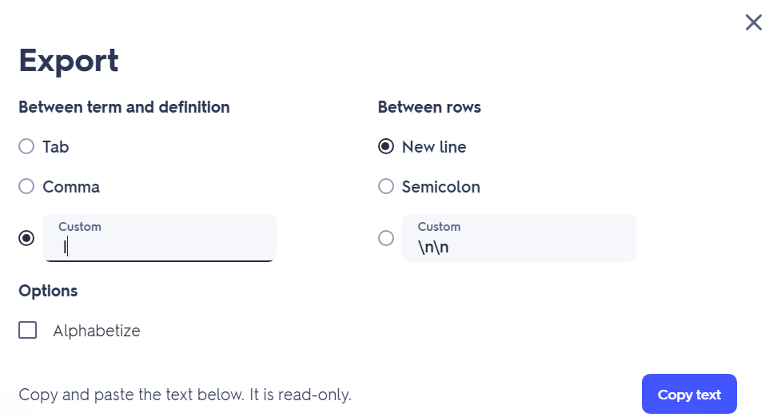

# OpenFlashcards Web

To use: https://robertjn64.github.io/OpenFlashcards_Web/

Based on: https://github.com/RobertJN64/OpenFlashcards

The free alternative to certain studying apps that demand payment for basic features, now with a clean web interface on github pages.

## Hotkeys
- Enter: submit / next screen
- 1-4: choose answer

## Import Steps
 - "Save and edit" a study set
 - Export
  
 - Definitions and words should be separated by ` | ` (space + pipe + space)
 - Save as set_name.cards